<div align="center">


<br/><br/>




<br/>

<a href="https://xtoybox.cloud"><strong>xtoybox.cloud</strong></a>
&nbsp;&nbsp;•&nbsp;&nbsp;
<a href="https://discord.gg/abh27Dwktt"><strong>Discord</strong></a>
&nbsp;&nbsp;•&nbsp;&nbsp;
<a href="https://github.com/jmita2288-debug?tab=repositories"><strong>Projetos</strong></a>

</div>

<br/>

## Sobre mim

Sou desenvolvedor independente e hoje concentro boa parte do meu trabalho no **XTOYBOX**.

Gosto de pegar uma ideia, testar no uso real e ir melhorando aos poucos — principalmente **interface, streaming, Remote Play, desempenho, estabilidade e navegação por controle**.

Meu primeiro projeto público foi o **xtoybox-apk-download**. Desde então, o XTOYBOX acabou virando o centro do que venho construindo para Android, TV, Web e agora iOS.

<br/>

<div align="center">
  
</div>

## XTOYBOX

<table>
<tr>
<td width="180" align="center">
  
</td>
<td>

**Meu projeto principal.**

É onde trabalho nas ideias que mais gosto: experiência de streaming, Remote Play, interface, controles, otimizações e versões para diferentes dispositivos.

<a href="https://xtoybox.cloud"><strong>Site oficial</strong></a>
&nbsp;·&nbsp;
<a href="https://xtoybox.cloud/api/download"><strong>Baixar APK</strong></a>
&nbsp;·&nbsp;
<a href="https://discord.gg/abh27Dwktt"><strong>Comunidade</strong></a>

</td>
</tr>
</table>

<br/>

## Projetos

<table>
<tr>
<td><strong>XTOYBOX</strong></td>
<td>projeto principal</td>
</tr>
<tr>
<td><strong>xtoybox-apk-download</strong></td>
<td>meu primeiro projeto publicado</td>
</tr>
<tr>
<td><strong>XTOYBOX-TV</strong></td>
<td>versão dedicada para TV</td>
</tr>
<tr>
<td><strong>XTOYBOX-IOS</strong></td>
<td>versão em desenvolvimento para iPhone</td>
</tr>
</table>

<br/>

## Tecnologias

<p align="center">
  
  &nbsp;&nbsp;
  
  &nbsp;&nbsp;
  
  &nbsp;&nbsp;
  
  &nbsp;&nbsp;
  
  &nbsp;&nbsp;
  
  &nbsp;&nbsp;
  
  &nbsp;&nbsp;
  
  &nbsp;&nbsp;
  
  &nbsp;&nbsp;
  
  &nbsp;&nbsp;
  
  &nbsp;&nbsp;
  
</p>

<p align="center">
  <code>TypeScript</code> · <code>JavaScript</code> · <code>React</code> · <code>React Native</code> · <code>Node.js</code> · <code>Java</code> · <code>Android</code> · <code>HTML/CSS</code> · <code>Vite</code> · <code>Tailwind CSS</code> · <code>GitHub Actions</code>
</p>

<br/>

## No momento

```text
XTOYBOX        ███████████████████░  evoluindo
XTOYBOX-TV     ██████████████░░░░░░  refinando
XTOYBOX-IOS    ██████░░░░░░░░░░░░░░  em desenvolvimento
```

<div align="center">


<sub>Construindo, testando e melhorando um pouco a cada versão.</sub>

</div>
