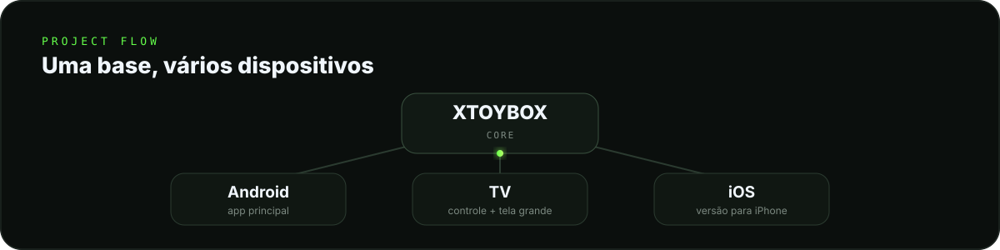

<div align="center">


<br/><br/>



<br/>

<a href="https://xtoybox.cloud"><strong>xtoybox.cloud</strong></a>
&nbsp;&nbsp;•&nbsp;&nbsp;
<a href="https://discord.gg/abh27Dwktt"><strong>Discord</strong></a>
&nbsp;&nbsp;•&nbsp;&nbsp;
<a href="https://github.com/jmita2288-debug?tab=repositories"><strong>Projetos</strong></a>

</div>

<br/>

## Sobre

Sou desenvolvedor independente e hoje concentro boa parte do meu trabalho no **XTOYBOX**.

Gosto de pegar uma ideia, testar de verdade e ir refinando versão por versão — principalmente **streaming, Remote Play, interface, desempenho, estabilidade e navegação por controle**.

Meu primeiro projeto público foi o **xtoybox-apk-download**. Depois dele, o XTOYBOX acabou virando o centro do que venho construindo para Android, TV, Web e iOS.

<br/>

## XTOYBOX

<table>
<tr>
<td width="175" align="center" valign="middle">
  
</td>
<td valign="middle">
  
</td>
</tr>
</table>

<div align="center">

<a href="https://xtoybox.cloud"><strong>Site oficial</strong></a>
&nbsp;&nbsp;·&nbsp;&nbsp;
<a href="https://xtoybox.cloud/api/download"><strong>Baixar APK</strong></a>
&nbsp;&nbsp;·&nbsp;&nbsp;
<a href="https://discord.gg/abh27Dwktt"><strong>Comunidade</strong></a>

</div>

<br/>



<br/>

## Tecnologias



<br/>

<div align="center">


&nbsp;&nbsp;&nbsp;

&nbsp;&nbsp;&nbsp;

&nbsp;&nbsp;&nbsp;

&nbsp;&nbsp;&nbsp;

&nbsp;&nbsp;&nbsp;

&nbsp;&nbsp;&nbsp;

&nbsp;&nbsp;&nbsp;


<br/><br/>


&nbsp;&nbsp;&nbsp;

&nbsp;&nbsp;&nbsp;

&nbsp;&nbsp;&nbsp;

&nbsp;&nbsp;&nbsp;

&nbsp;&nbsp;&nbsp;

&nbsp;&nbsp;&nbsp;


</div>

<br/>

## Agora

```text
XTOYBOX      mobile  →  evoluindo interface, streaming e estabilidade
XTOYBOX-TV   tv      →  refinando navegação por controle e base para TV
XTOYBOX-IOS  ios     →  construindo a adaptação para iPhone
```

<br/>

<div align="center">
  
  <br/>
  <sub>build • test • ship • improve</sub>
</div>
