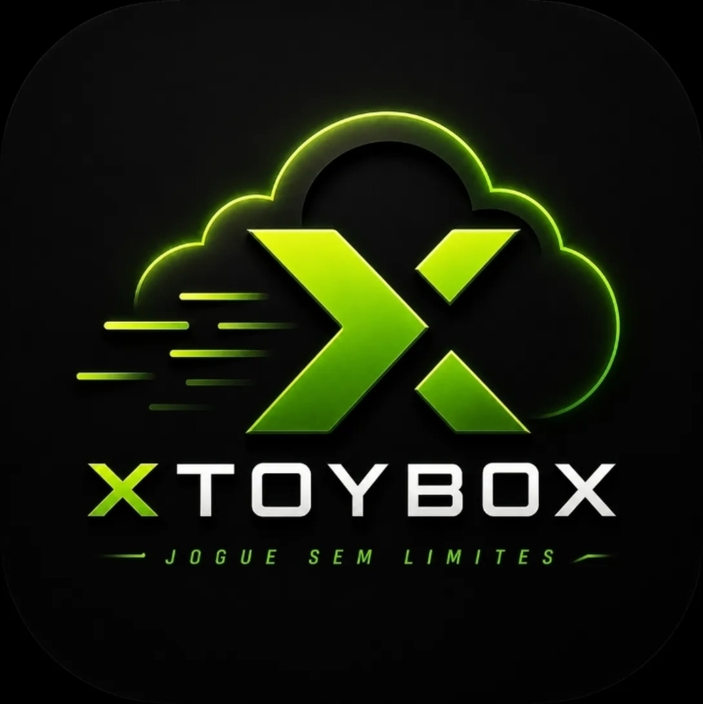

 

<a href="https://xtoybox.cloud"><strong>Site</strong></a>
&nbsp;&nbsp;•&nbsp;&nbsp;
<a href="https://github.com/jmita2288-debug?tab=repositories"><strong>Repositórios</strong></a>
&nbsp;&nbsp;•&nbsp;&nbsp;
<a href="https://discord.gg/abh27Dwktt"><strong>Discord</strong></a>

 

## Sobre mim

Sou desenvolvedor independente e gosto de trabalhar em produtos que misturam **mobile, streaming, web e automação**.

Hoje meu foco principal está no ecossistema **XTOYBOX**, mas meu trabalho vai além de uma única aplicação: desenvolvo interfaces, integrações, ferramentas, automações e versões para diferentes plataformas, sempre tentando melhorar **desempenho, estabilidade e experiência de uso**.

Gosto de testar as coisas no uso real e ir refinando aos poucos. Boa parte do meu desenvolvimento passa por **React Native, TypeScript, JavaScript, Java, WebRTC e Node.js**.

---

## Principais projetos

<table>
<tr>
<td width="125" align="center" valign="middle">
  
</td>
<td valign="middle">

**XTOYBOX** — meu projeto principal, voltado para experiências de streaming e Remote Play em diferentes dispositivos.

**XTOYBOX-TV** — versão dedicada à experiência em TV e navegação por controle.

**XTOYBOX-IOS** — adaptação do ecossistema para iPhone.

**xtoybox-apk-download** — meu primeiro projeto público e a base web usada para apresentar e distribuir o XTOYBOX.

**xtoybox-discord-bot** — automações e ferramentas para a comunidade.

</td>
</tr>
</table>

---

## Linguagens que mais aparecem nos meus projetos

 

&nbsp;&nbsp;&nbsp;

&nbsp;&nbsp;&nbsp;

&nbsp;&nbsp;&nbsp;

&nbsp;&nbsp;&nbsp;

&nbsp;&nbsp;&nbsp;

&nbsp;&nbsp;&nbsp;

&nbsp;&nbsp;&nbsp;

 

## Stack e ferramentas

**Mobile & streaming**  
React Native · Android · WebRTC · React Navigation · Gradle

**Web**  
React · TypeScript · Vite · TanStack · Tailwind CSS · Cloudflare

**Backend & automação**  
Node.js · JavaScript · GitHub Actions · APIs · automações para Discord

**Desenvolvimento**  
Git · GitHub · Yarn / npm · ESLint · Prettier · Jest

 

&nbsp;&nbsp;&nbsp;

&nbsp;&nbsp;&nbsp;

&nbsp;&nbsp;&nbsp;

&nbsp;&nbsp;&nbsp;

&nbsp;&nbsp;&nbsp;

&nbsp;&nbsp;&nbsp;

---

## Onde me encontrar

<a href="https://xtoybox.cloud"><strong>xtoybox.cloud</strong></a>
&nbsp;&nbsp;•&nbsp;&nbsp;
<a href="https://github.com/jmita2288-debug?tab=repositories"><strong>GitHub</strong></a>
&nbsp;&nbsp;•&nbsp;&nbsp;
<a href="https://discord.gg/abh27Dwktt"><strong>Discord</strong></a>

  

Construindo, testando e melhorando um pouco a cada versão.

