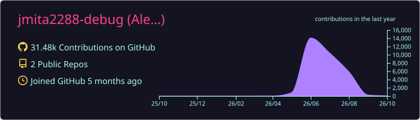
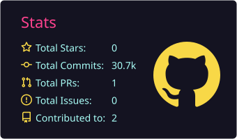
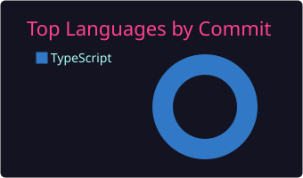
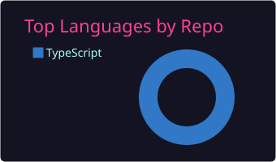

# jmita2288-debug

**Desenvolvedor independente · Mobile · Streaming · Web**

<a href="https://xtoybox.cloud">Site</a>
&nbsp;·&nbsp;
<a href="https://github.com/jmita2288-debug?tab=repositories">Repositórios</a>
&nbsp;·&nbsp;
<a href="https://discord.gg/abh27Dwktt">Discord</a>

---

## Sobre mim

Trabalho principalmente em aplicações para **mobile, streaming e web**, com foco em interface, desempenho, estabilidade e experiência de uso.

Hoje meu principal projeto é o **XTOYBOX**. Também desenvolvo versões e ferramentas relacionadas para TV, iOS, web e automação.

Gosto de trabalhar de forma prática: testar, corrigir o que incomoda no uso real e evoluir os projetos sem adicionar complexidade desnecessária.

---

## Projetos

| Projeto | Foco |
| --- | --- |
| **XTOYBOX** | Projeto principal |
| **XTOYBOX-TV** | Experiência dedicada para TV |
| **XTOYBOX-IOS** | Versão para iPhone |
| **[xtoybox-apk-download](https://github.com/jmita2288-debug/xtoybox-apk-download)** | Meu primeiro projeto público e site do XTOYBOX |
| **xtoybox-discord-bot** | Automação e ferramentas para a comunidade |

---

## Linguagens

<table>
<tr>
<td align="center" width="110"> TypeScript</td>
<td align="center" width="110"> JavaScript</td>
<td align="center" width="110"> Java</td>
<td align="center" width="110"> Python</td>
<td align="center" width="110"> GLSL</td>
</tr>
<tr>
<td align="center" width="110"> XML</td>
<td align="center" width="110"> HTML</td>
<td align="center" width="110"> CSS</td>
<td align="center" width="110"> Swift</td>
<td align="center" width="110"> Objective-C</td>
</tr>
</table>

---

## Tecnologias e ferramentas

**Plataformas e runtime**

<table>
<tr>
<td align="center" width="110"> React Native</td>
<td align="center" width="110"> WebRTC</td>
<td align="center" width="110"> Android</td>
<td align="center" width="110"> iPhone / iOS</td>
<td align="center" width="110"> TV / TV Box</td>
<td align="center" width="110"> Node.js</td>
</tr>
</table>

**Desenvolvimento e build**

<table>
<tr>
<td align="center" width="110"> Gradle</td>
<td align="center" width="110"> Vite</td>
<td align="center" width="110"> Tailwind CSS</td>
<td align="center" width="110"> Cloudflare</td>
<td align="center" width="110"> GitHub Actions</td>
<td align="center" width="110"> Git</td>
</tr>
</table>

**Bibliotecas e ferramentas adicionais**

 

---

## Estatísticas do GitHub

 

 

---

## Gráfico de contribuições

<picture>
  <source media="(prefers-color-scheme: dark)" srcset="https://raw.githubusercontent.com/jmita2288-debug/jmita2288-debug/output/github-snake-dark.svg" />
  <source media="(prefers-color-scheme: light)" srcset="https://raw.githubusercontent.com/jmita2288-debug/jmita2288-debug/output/github-snake.svg" />
  
</picture>

---

<a href="https://xtoybox.cloud">xtoybox.cloud</a>
&nbsp;·&nbsp;
<a href="https://github.com/jmita2288-debug?tab=repositories">GitHub</a>
&nbsp;·&nbsp;
<a href="https://discord.gg/abh27Dwktt">Discord</a>

